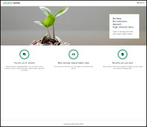
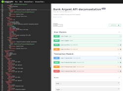

[](https://fr.reactjs.org/)
[](https://reactrouter.com/)
[](https://create-react-app.dev/)

# P13 - ArgentBank - Front-end application

[](./hp.png)
[](./Ranque_Thomas_1_swagger_phase_2_042022.yaml) - API documentation

[](./Slide_P13.pdf) - SlideShow

## Project's presentation

Argent Bank is a newcomer to the world of online banking. The project is to quickly launch the online application allowing bank customers to connect to the services and manage their accounts.

Two phases are defined to initiate the project:
* **Phase 1** - Implement in a React application the static HTML/CSS templates provided, then set up user connections' security. It will also be necessary to retrieve basic user's informations via API.

* **Phase 2** - Make API modeling proposals for the development of the project's second phase (visualization of the month's transactions, details on each transaction, and capability to modify these details). [*Swagger*](https://swagger.io/) is designed to create a .yaml file in order to proceed.

&nbsp;

*Two repositories are needed to enable the project to run:*


## 1. BACK-END API

You can get the API code here: <https://github.com/Peanuts-83/P13-Bank-API/tree/master>

Be noticed this codebase is required in order to use all the functionalities of the front-end application. Make sure not to use the original provided codebase as it is deprecated...
Please refer to the Readme.md documentation provided for installation and use.
### URL/PORT

The default URL used by the micro-API is <http://localhost:3001>.

&nbsp;

## 2. FRONT-END

The present repository contains this part of the project. Any package manager such as npm or yarn is required.

* You have to clone the project locally with either/or :

```bash
# HTTPS
 git clone https://github.com/Peanuts-83/P13-Bank-Front.git


# SSH
git clone git@github.com:Peanuts-83/P13-Bank-Front.git
```

* Then access inside your local repository and install dependencies using :

```bash
npm install
```

* Launch the application with :

```bash
 npm start
 ```

### Use the application

You can make use of the credentials below to access the application.
It is also possible to create a new user, but consider the transactions page shall not to be filled as this is a in-course developpemnt application.

Tony Stark

    Email: tony@stark.com
    Password: password123

Steve Rogers

    Email: steve@rogers.com,
    Password: password456

### URL/PORT

The default URL used by the application is <http://localhost:3000>.

&nbsp;

# Getting Started with Create React App

This project was bootstrapped with [Create React App](https://github.com/facebook/create-react-app).

## Available Scripts

In the project directory, you can run:

### `npm start`

Runs the app in the development mode.\
Open [http://localhost:3000](http://localhost:3000) to view it in your browser.

The page will reload when you make changes.\
You may also see any lint errors in the console.

### `npm test`

Launches the test runner in the interactive watch mode.\
See the section about [running tests](https://facebook.github.io/create-react-app/docs/running-tests) for more information.

### `npm run build`

Builds the app for production to the `build` folder.\
It correctly bundles React in production mode and optimizes the build for the best performance.

The build is minified and the filenames include the hashes.\
Your app is ready to be deployed!

See the section about [deployment](https://facebook.github.io/create-react-app/docs/deployment) for more information.

### `npm run eject`

**Note: this is a one-way operation. Once you `eject`, you can't go back!**

If you aren't satisfied with the build tool and configuration choices, you can `eject` at any time. This command will remove the single build dependency from your project.

Instead, it will copy all the configuration files and the transitive dependencies (webpack, Babel, ESLint, etc) right into your project so you have full control over them. All of the commands except `eject` will still work, but they will point to the copied scripts so you can tweak them. At this point you're on your own.

You don't have to ever use `eject`. The curated feature set is suitable for small and middle deployments, and you shouldn't feel obligated to use this feature. However we understand that this tool wouldn't be useful if you couldn't customize it when you are ready for it.

## Learn More

You can learn more in the [Create React App documentation](https://facebook.github.io/create-react-app/docs/getting-started).

To learn React, check out the [React documentation](https://reactjs.org/).

### Code Splitting

This section has moved here: [https://facebook.github.io/create-react-app/docs/code-splitting](https://facebook.github.io/create-react-app/docs/code-splitting)

### Analyzing the Bundle Size

This section has moved here: [https://facebook.github.io/create-react-app/docs/analyzing-the-bundle-size](https://facebook.github.io/create-react-app/docs/analyzing-the-bundle-size)

### Making a Progressive Web App

This section has moved here: [https://facebook.github.io/create-react-app/docs/making-a-progressive-web-app](https://facebook.github.io/create-react-app/docs/making-a-progressive-web-app)

### Advanced Configuration

This section has moved here: [https://facebook.github.io/create-react-app/docs/advanced-configuration](https://facebook.github.io/create-react-app/docs/advanced-configuration)

### Deployment

This section has moved here: [https://facebook.github.io/create-react-app/docs/deployment](https://facebook.github.io/create-react-app/docs/deployment)

### `npm run build` fails to minify

This section has moved here: [https://facebook.github.io/create-react-app/docs/troubleshooting#npm-run-build-fails-to-minify](https://facebook.github.io/create-react-app/docs/troubleshooting#npm-run-build-fails-to-minify)
